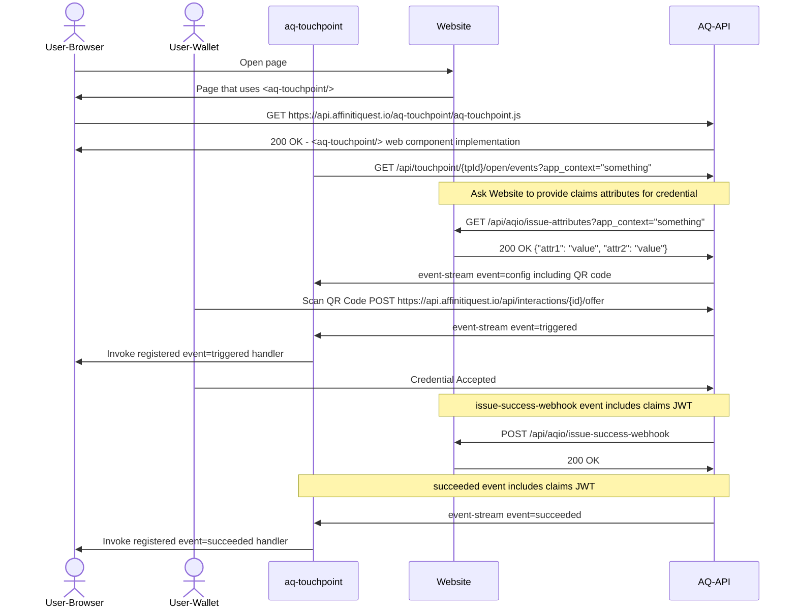
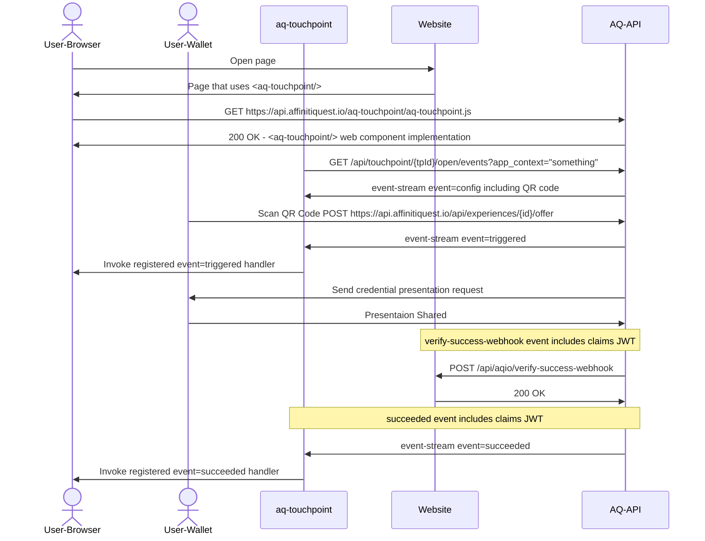

# aq-touchpoint-demo

A FoalTS-based app that demonstrates use of the ```<aq-touchpoint/>``` component. Details on this component can be found later in this file.

This app also demonstrates how to use ```<aq-servicedesk/>``` and ```<aq-remotedevice/>```. For descriptions of these components, please see: [Remote Control](remotecontrol.md).

## Requirements

- NodesJS >= 18
- FoalTS ClI

## Installation

```sh
# install node module dependencies
npm install 
# install the FoalTS CLI
npm install -g @foal/cli 
```

## Configuration
1. change directory into the aq-touchpoint-samples directory
```bash
cd <your path to>/aq-touchpoint-samples
```
2. Edit the (hidden) file called .env
```bash
vi .env
```
3. Modify the configuration values with the specifics for your tenant.

## Run Server

```sh
#run the development server
npm run dev 
```

## Open static page

[http://localhost:3001](http://localhost:3001)

## Customizing
[Modify Authentication Credentials](src/app/controllers/auth.controller.ts)

[Modify Issuance Credential Attributes](src/app/controllers/webhook.controller.ts) [Or](config/default.json)

[Modify config which specifies auth, touchpoint and credential settings](config/default.json)


## Integrating your Application using AffinitiQuest Touchpoints

AffinitiQuest introduces an abstraction called a "TouchPoint" (TP). TouchPoints are comprised of multiple parts:
- a database entity. 
- a management User Interface.
- a web component.
- a set of web APIs.
- a webhook events representing successfull execution of the TouchPoint operation.

### TouchPoint Entity
Each TouchPoint Entity contains:
``` json
{
  "id":  "<touchPointId>",
  "name": "<TouchPoint Name>", 
  "description": "a description of what this touchpoint is used for",
  "title": "Title shown on <aq-touchpoint/> component",
  "walletName": "Name of Wallet shown in <aq-touchpoint/> component",
  "brandId": "<brandId>",
  "operation": {
    "type": "<issue|verify>",
    "id": "<credentialDesignId|proofDesignId>",
    "timeToLiveInSeconds": 600
  },
  "issueAttributesWebhookUrl": "<url> | null", // webhook invoked to request issuance attributes
  "successWebhookUrl": "<url> | null",   // webhook invoked on success
  "webhookHeaders": "<jsonStringArrayOfNameValuePairs> | null"
}
```

### TouchPoint Web APIs 

#### POST /api/authenticate
Requests a JWT token to be used with other API calls,
``` json
Request Body
{
  "tenantId": "Azure Tenant Identifier",
  "clientId": "Azure Client Identifier",
  "clientSecret": "Azure Client Secret"
}
```
``` json
200 OK
Response Body
{
  "accessToken": "JWT Access Token"
}
```

For other API calls below, supply the received accessToken by adding an HTTP Request header:
```
Authorization: Bearer <YourJWTTokenHere>
```

#### GET /api/touchpoint/{touchpointId}/open/events
Kicks off the invocation of a TouchPoint by id AND opens a text/event-stream. This API is designed to be used by the ```<aq-touchpoint/>``` web component described later in this document.

| Query Parameter | Default | Notes |
|--|--|--|
| lang | "en-ca" | Optional: locale/language preference |
| render | "none" | Optional: enumeration: ["text/html", "none"]. Default "text/html" |
| appContext | "" | Optional: string representing the application context|
| threadId | "" | UUID V4 string. Should be random.

|Event Name| Event Payload |
|--|--|
| exception | exceptions returned by the endpoint - data payload includes a reason
| config | data payload described below¹ |
| triggered | appContext |
| failed | appContext |
| succeeded | data payload described below² |

¹ "config" message data
``` json
{
  "threadId: "<Guid>",
  "timeToLiveInSeconds": 600,
  "render": {
    "contentType":   "<none|text/html>",
    "content": "content to render"
  }
}
```

² "succeeded" message data
```json
{
  "type": "succeeded",
  "threadId": "<Guid>",
  "touchpoint": {
    "id": "b28902f1-f023-4cee-b341-a5f07658fd83",
    "type": "verify",
    "name": "Gallaghers.ca Membership Proof",
    "description": "Verify Gallaghers.ca Membership Card",
    "title": "Check - Membership Card"
  },
  "brand": {
    "name": "Gallaghers.ca",
    "id": "a5f3ce61-6ad0-434b-a89b-d1d9fc8f6f58"
  },
  "appContext": "",
  "claimsJwt": "see claimsJwt³ formats below",
  "credentialDesignId": "f24502f1-f023-4cee-b341-a5f076584683"
  "revocationHandle": "This will only be provided on issuance for revocable credentials"
}
```

³the claimsJwt contains claim attributes that were issued or verified. The JWT can be validated using the RSA public key received in the ResponseBody when doing a GET /api/touchpoint/{touchpointid}/publickey

##### claimsJwt Format for Issuance
```json
{
  "iss": "Gallaghers.ca",
  "iat": 1680287023,
  "exp": 1680287323,
  "claims": {
    "Organization Id": "7",
    "Organization": "Affiniti Quest",
    "Contact Id": "11",
    "Contact": "Warren Gallagher",
    "Email": "warren@example.com",
    "Member Class": "Member",
    "Member Role": "",
    "__credentialId__": "d3d17ca2-af17-47d1-a922-d2a96fc44ba7"
  }
}
```

##### claimsJwt Format for Verification
```json
{
  "iss": "Gallaghers.ca",
  "iat": 1680287248,
  "exp": 1680287548,
  "claims": [
    {
      "credentialDesignId": "709383f54b6e406fb6db9de61745efa7",
      "claims": {
        "__credentialId__": "d3d17ca2-af17-47d1-a922-d2a96fc44ba7",
        "Organization Id": "7",
        "Organization": "Affiniti Quest",
        "Contact Id": "11",
        "Contact": "Warren Gallagher",
        "Email": "warren@example.com",
        "Member Class": "Member",
        "Member Role": ""
      }
    },
    {
      "credentialDesignId": "ef8366f5e60641ad80fefbcd6a5c49a0",
      "claims": {
        "__credentialId__": "ca241066-0511-4fbc-81bc-a386340871d8",
        "name": "Warren Gallagher",
        "address": "12345 Someplace Rd, SomeTown, ON K0B 7C0",
        "phoneNumber": "555-123-4567"
      }
    }
  ]
}
```

#### GET /api/touchpoint/{touchpointId}/open
Kicks off the invocation of a TouchPoint by id returning a touchpoint descriptor. Unlike the previous API, this one does not open an event stream but only communicates events via webhooks.

| Query Parameter | Default | Notes |
|--|--|--|
| lang | "en-ca" | Optional: locale/language preference |
| render | "none" | Optional: enumeration: ["text/html", "none"]. Default "none" in which case the render property in the response will be null |
| appContext | "" | Optional: string representing the application context|
| threadId | "" | Optional: UUID V4 string. Should be random. If not supplied, one will be auto-generated.

TouchpointDescriptor Response Body
``` json
{
  "threadId": "<Guid>",
  "touchpoint": {
    "id": "touchpointid",
    "type": "<issue|verify>",
    "name": "<credential design name|proof design name>",
    "title": "Title shown on <aq-touchpoint/> component",
    "walletName": "Name of Wallet shown in <aq-touchpoint/> component",
    "timeToLiveInSeconds": 600
  },
  "brand": {
    "name": "Name of Brand",
    "logo": "data:image/png,%89PNG%0D%0A..."
  },
  "action": {
    "url": "https://some-server/path",
    "qrCode": "data:image/png,%89PNG%0D%0A..." // QrCode representing the actionUrl
  },
  "render": {
    "contentType":   "<none|text/html>",
    "content": "content to render"
  }
}

```
#### GET /api/touchpoint/{touchpointId}/publickey
Retrieves the publicKey used to validate the claimsJWT

ResponseBody with Content-Type: application/x-pem-file
```
-----BEGIN PUBLIC KEY-----
MIIBCgKCAQEAzVhYuWG53dkvcg6KdgAXLm+P4iAgFyMCoFuXmUJTdnp9K5l0DOpz
B799o19gm0qH2DP8deJkHvCGX7xpEnqw53xSB4SQ38YPw/7QsePUOe4/XBODs8L2
7Emfp8rLyfDc48dV/UQ5bGT/WorSuMOO3dMWSgwN2jdBV6hMKg/i99qt9J82y5gb
UcBcl+VblhNdrETCYjYfZj8Znfp7mbDxOUKvmPHS/Sb+FvURm6i8b4TKPT4wIlNx
RyqBfXy+Y93rXQU0k5tG5gcbVM2333qqdBNB8smj5zH55hXJVYZCJ4gJAza1EzGl
rN6tAwz+4K07JqIg2ehp/nZjVeVmnwIK1wIDAQAB
-----END PUBLIC KEY-----
```

### TouchPoint Webhooks

### TouchPoint Issue Attributes Request Webhook
If a TouchPoint entity includes a issueAttributesWebhookUrl then, upon TouchPoint open, the webhook will be invoked by issuing an HTTP GET to the specified url with any specified headers. An optional query parameter app_context may be provided if the open request on the webhook provided an app_context.

The invocation will be something like
GET <issueAttributeWebhookUrl>?app_context=<providedAppContext>

This should return a JSON payload that describes the attributes to be populated in the credential. This should reflect the attributes described in the Credential Design created in the AffinitiQuest admin portal.

``` json
200 OK
Webhook Response Body
{
  "attributeName1": "attributeValue",
  "attributeName2": "attributeValue"
}
```

### TouchPoint Success Webhook
If a TouchPoint entity includes a successWebhookUrl then, upon TouchPoint success the webhook will be invoked by executing an HTTP POST to the specified url with any specified headers.
``` json
Webhook Request Body
{
  "touchpoint": {
    "id": "touchpointid",
    "name": "the name of the touchpoint",
    "description": "Description of the TouchPoint",
    "type": "<issue|verify>"
  },
  "brand": {
    "id": "brandid",
    "name": "Name of Brand",
  },
  "appContext": "<Whatever app_context string was provided in the open request",
  "claimsJwt": "the JWT containing claim attributes that were issued or verified",
  "revocationHandle": "This will only be supplied on issuance for revokable credentials"
}
```
If the webhook consumer wishes to validate the received JWT, it must have access to the public key. This can either be provisioned in the webhook consumer app or it can retrieve it dynamically using the previously described web API GET /api/touchpoint/{touchpointId}/publickey

### TouchPoint Web Component - **```<aq-touchpoint/>```**
A new web component will be introduced that will replace the existing components. This component will be **```<aq-touchpoint/>```**.

|Attribute Name| Description |
|--|--|
| class | "tp-light" for light colour theme, "tp-dark" for dark colour theme. defaults to "tp-light" |
| auth_url | required unless auth_jwt is provided |
| auth_jwt | required unless auth_url is provided |
| tp_id | required - identifier of the touchpoint  |
| app_context | optional - string provided to any invoked webhooks |
| lang | optional - defaults to "en-ca"  |
| success_redirect_url | optional - url browser should navigate to upon success  |
| fail_redirect_url | optional - url browser should navigate to upon failure  |
| logging | log to browser console "true" or "false". default = "false" |

Events sent over the text/event-stream from the server to the web component.
|Event| Description |
|--|--|
| triggered | a wallet has scanned the QRcode |
| unauthorized | open touchpoint with supplied auth_jwt failed with 401. Likely token expired. | 
| failed | the touchpoint has failed |
| succeeded | the touchpoint has succeeded |
| timeout | the touchpoint has not completed within the allotted time |

| Methods | Description |
|--|--|
| decodeJwt(jwtToDecode) | can be called from success event handler as ```event.currentTarget.decodeJwt(event.detail.claimsJwt)``` |
| asyncGetPublicKey() | can be called from success event handler as ```const publicKey = await event.currentTarget.asyncGetPublicKey()``` |

``` html
<!-- example -->
<aq-touchpoint auth_url="/api/authenticate" tp_id="a uuid for a touchpoint" lang="en-ca" success_redirect_url="/membership-issued" />
```

The <aq-touchpoint/> component will utilize the afore mentioned APIs. It further will change it's visual appearance and behaviour based on the TouchPoint Type that it receives as part of the response to the GET /api/touchpoint/{touchpointId}/open request.

### Key Management
When claim attributes (either issued or verified) are being delivered to a 3rd-party application, they are provided in the form of a JWT asymmetrically signed using RS256.

As a result there is a need to generate and manage RSA keys used for this purpose.

#### Key Generation
When a new brand is created a 2048 bit RSA key pair will be generated and stored.

### Key Storage
A database table called BrandKeys will be created that associates a brandId with the public key and private key. The private key will be encrypted.

A future variation will add a new table called TouchpointKeys that associates a touchpointId with a public/private key pair. The private key will be encrypted.

#### Signing JWT
When a touchpoint success event is being generated the RSA private key associated with the brand to which the TouchPoint belongs will be retrieved and used to sign the claimsJwt.

## Examples

### Issue Flow


### Verify Flow



