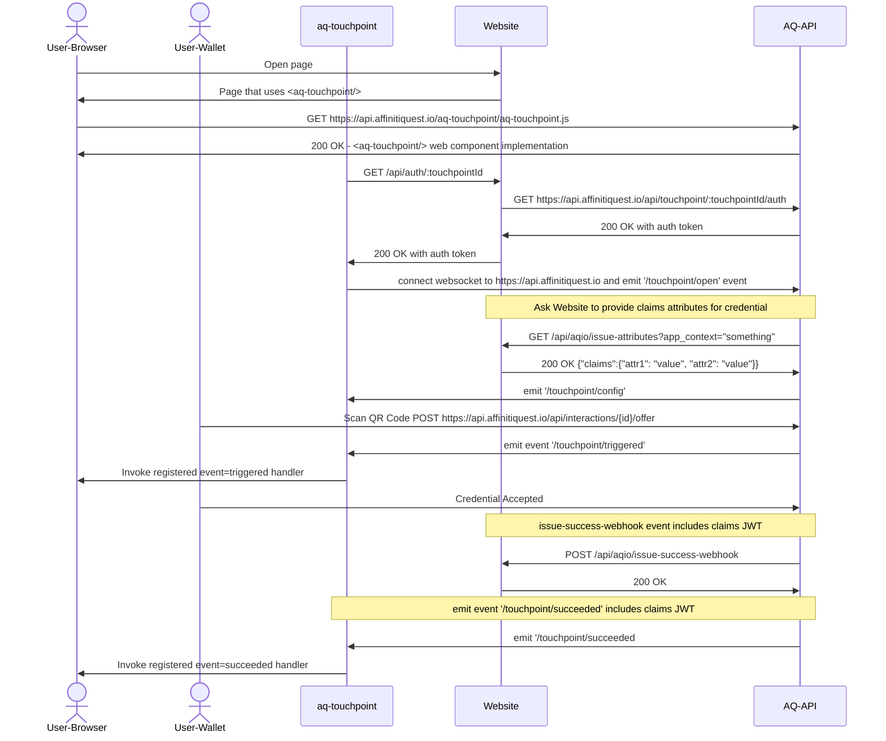
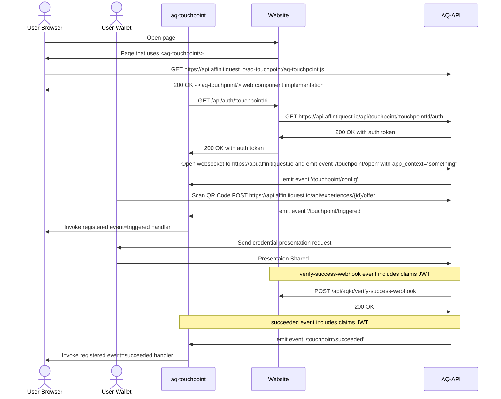

# aq-touchpoint-demo

A FoalTS-based app that demonstrates use of the ```<aq-touchpoint/>``` component. Details on this component can be found later in this file.

This app also demonstrates how to use ```<aq-servicedesk/>``` and ```<aq-remotedevice/>```. For descriptions of these components, please see: [Remote Control](remotecontrol.md).

For security considerations on use of touchpoints please see: [Touchpoint Security Considerations](security.md)
## Requirements

- NodesJS >= 18
- FoalTS ClI

## Installation

```sh
# install node module dependencies
npm install
# install the FoalTS CLI
npm install -g @foal/cli
```

## Configuration
1. change directory into the aq-touchpoint-samples directory
```bash
cd <your path to>/aq-touchpoint-samples
```
2. Edit the (hidden) file called .env
```bash
vi .env
```
3. Modify the configuration values with the specifics for your tenant.

## Run Server

```sh
#run the development server
npm run dev
```

## Open static page

[http://localhost:3007](http://localhost:3007)

## Customizing
[Modify Authentication Credentials](src/app/controllers/auth.controller.ts)

[Modify Issuance Credential Attributes](src/app/controllers/webhook.controller.ts) [Or](config/default.json)

[Modify config which specifies auth, touchpoint and credential settings](config/default.json)


## Integrating your Application using AffinitiQuest Touchpoints

The AffinitiQuest Credential Orchestration system provides an abstraction called "TouchPoint" (TP). TouchPoints provide easy integration for 3rd-party applications. A touchpoint is configured through the AffinitiQuest administration portal.

There are three primitive touchpoint types that can be configured:
- Issue
  - used to issue a credential and is bound to a particular credential design and issuer
  - the 3rd-party may provide a webhook that can be used to fetch the attribute values that should be used in the credential
  - the 3rd-party may provide a webhook that can be used to notify that a credential has been successfully issued.
- Verify
  - used to verify a credential and is bound to a particular proof design
  - the 3rd-party may provide a webhook that can be used to notify that a credential has been successfully verified.
- Revoke
  - used to revoke a credential and is bound to a particular credential design and issuer

Each configured touchpoint is assigned a unique identifier.

### TouchPoint Web APIs

#### GET /api/touchpoint/:touchpointId/auth
Requests a JWT token to be used with as a ```auth_jwt``` attribute with any of the touchpoint web components.
HTTP Basic Auth Header:
```
Authorization: Basic <your-base-64-encoded-tenantId:api-key>
```

200 OK Response Body
```
access-token-in-the-form-of-a-jwt-string
```

#### GET /api/touchpoint/{touchpointId}/open
Kicks off the invocation of a TouchPoint.

HTTP Basic Auth Header:
```
Authorization: Basic <your-base-64-encoded-tenantId:api-key>
```

| Query Parameter | Default | Notes |
|--|--|--|
| lang | "en-ca" | Optional: locale/language preference |
| format | "none" | Optional: enumeration: ["none", "html-tag", "html-page"] |
| layout |        | Optional: enueration: ["none", "minimal", "compact", "full"] |
| appContext | "" | Optional: string representing the application context|

Response is the touchpoint Configuration:
```json
{
  "threadId": "<uuid>",
  "touchpoint": {
    "id": "<uuid>",
    "type": "<issue|verify|revoke>",
    "name": "touchpoint Name",
    "description": "description of touchpoint",
    "title": "Title for this touchpoint",
    "timeToLiveInSeconds": "300",
    "accessToken": "<jwt-that-can-be-used-with-this-touchpoint">,
    "layout": "<none|minimal|compact|full>"
  },
  "authority": {
    "name": "Name of Issuing or Verifying Authority",
    "logo": "url-for-logo-of-authority",
  },
  "render": { // this may not exist if format=none 
    "contentType": "text/html",
    "content": "<aq-touchpoint/> rendered into a page or only the tag"
  }
}
```

If format is html-tag, then it can be injected into the browser DOM.

#### GET /api/touchpoint/{touchpointId}/open
Kicks off the invocation of a TouchPoint by id returning a touchpoint descriptor. Unlike the previous API, this one does not open an event stream but only communicates events via webhooks.

| Query Parameter | Default | Notes |
|--|--|--|
| lang | "en-ca" | Optional: locale/language preference |
| render | "none" | Optional: enumeration: ["text/html", "none"]. Default "none" in which case the render property in the response will be null |
| appContext | "" | Optional: string representing the application context|
| threadId | "" | Optional: UUID V4 string. Should be random. If not supplied, one will be auto-generated.

TouchpointDescriptor Response Body
``` json
{
  "threadId": "<Guid>",
  "touchpoint": {
    "id": "touchpointid",
    "type": "<issue|verify>",
    "name": "<credential design name|proof design name>",
    "title": "Title shown on <aq-touchpoint/> component",
    "walletName": "Name of Wallet shown in <aq-touchpoint/> component",
    "timeToLiveInSeconds": 600
  },
  "brand": {
    "name": "Name of Brand",
    "logo": "data:image/png,%89PNG%0D%0A..."
  },
  "action": {
    "url": "https://some-server/path",
    "qrCode": "data:image/png,%89PNG%0D%0A..." // QrCode representing the actionUrl
  },
  "render": {
    "contentType":   "<none|text/html>",
    "content": "content to render"
  }
}
```

#### GET /api/touchpoint/{touchpointId}/publickey/{kid}
Retrieves the publicKey used to validate the claimsJWT

ResponseBody with Content-Type: application/x-pem-file
```
-----BEGIN PUBLIC KEY-----
MIIBCgKCAQEAzVhYuWG53dkvcg6KdgAXLm+P4iAgFyMCoFuXmUJTdnp9K5l0DOpz
B799o19gm0qH2DP8deJkHvCGX7xpEnqw53xSB4SQ38YPw/7QsePUOe4/XBODs8L2
7Emfp8rLyfDc48dV/UQ5bGT/WorSuMOO3dMWSgwN2jdBV6hMKg/i99qt9J82y5gb
UcBcl+VblhNdrETCYjYfZj8Znfp7mbDxOUKvmPHS/Sb+FvURm6i8b4TKPT4wIlNx
RyqBfXy+Y93rXQU0k5tG5gcbVM2333qqdBNB8smj5zH55hXJVYZCJ4gJAza1EzGl
rN6tAwz+4K07JqIg2ehp/nZjVeVmnwIK1wIDAQAB
-----END PUBLIC KEY-----
```

#### POST /api/touchpoint/{touchpointId}/validate-claims-jwt
Validates a jwt associated with a touchpoint.

POST Request Body
```json
{
  "jwt": "the-jwt-value"
}
```

ResponseBody with Content-Type: /application/json
See [ClaimsJwt Format For Issuance](#claimsjwt-format-for-issuance).
See [ClaimsJwt Format For Verification](#claimsjwt-format-for-verification)

### TouchPoint Webhooks

### TouchPoint Issue Attributes Request Webhook
If a TouchPoint entity includes a issueAttributesWebhookUrl then, upon TouchPoint open, the webhook will be invoked by issuing an HTTP GET to the specified url with any specified headers. An optional query parameter app_context may be provided if the open request on the webhook provided an app_context.

The invocation will be something like
GET <issueAttributeWebhookUrl>?touchpointId=<some-touchpoint-id>&jwt=<jwt-value>&app_context=<providedAppContext>

This should return a JSON payload that describes the attributes to be populated in the credential. This should reflect the attributes described in the Credential Design created in the AffinitiQuest admin portal.
The validFrom value defaults to the time of issuance.
The validUntil value defaults to the time of issuance plus the expiry in the credential design.
The format of the claims should reflect the values expected by the type of credential.  For example, if it is a
verified credential, it should contain the attribute values expected for that credential design schema.
If it is an mdoc, it should match the expected mdoc format..

|Attribute Name| Description |
|--|--|
| validFrom | optional - string indicating the mdoc validFrom date for the credential. Default is the time of issuance |
| validUntil | optional - string indicating the mdoc validUntil date for the credential. Default is the valueFrom date added with the expiry value defined in the credential design|
| claims | an object indicating the credential attributes or mdoc values|

VC example response
``` json
200 OK
Webhook Response Body
{
  "validFrom": "2024-02-02T14:33:29.380Z",
  "validUntil": "2024-02-16T14:33:29.380Z",
  "claims": {
    "attributeName1": "attributeValue1",
    "attributeName2": "attributeValue2"
  }
}
```

MDOC example response
``` json
200 OK
Webhook Response Body
{
  "validFrom": "2024-02-02T14:33:29.380Z",
  "validUntil": "2024-02-16T14:33:29.380Z",
  "claims": {
    "docType": "com.example.mdoc.mydoc.1",
    "namespaces": [
        {
          "com.example.mdoc.mydoc.1": {
            "attributeName1": "attributeValue1"
          }
        },
        {
          "com.example.mdoc.mydoc.personal.1": {
            "personalAttributeName1": "personalAttributeValue1",
            "personalAttributeName2": "personalAttributeValue2",
          }
        }
      ]
  }
}
```

### TouchPoint Success Webhook
If a TouchPoint entity includes a successWebhookUrl then, upon TouchPoint success the webhook will be invoked by executing an HTTP POST to the specified url with any specified headers.
``` json
Webhook Request Body
{
  "touchpoint": {
    "id": "touchpointid",
    "name": "the name of the touchpoint",
    "description": "Description of the TouchPoint",
    "type": "<issue|verify>"
  },
  "brand": {
    "id": "brandid",
    "name": "Name of Brand",
  },
  "appContext": "<Whatever app_context string was provided in the open request",
  "claimsJwt": "the JWT containing claim attributes that were issued or verified",
  "revocationHandle": "This will only be supplied on issuance for revokable credentials"
}
```
If the webhook consumer wishes to validate the received JWT, it must have access to the public key. This can either be provisioned in the webhook consumer app or it can retrieve it dynamically using the previously described web API GET /api/touchpoint/{touchpointId}/publickey/{kid}

### TouchPoint Web Component - **```<aq-touchpoint/>```**
```<aq-touchpoint/>``` connects to the AffinitiQuest backend over a websocket so it can receive status events. The use and management of the websocket completely managed by the component as long as it can authenticate using the methods described below.

|Attribute Name| Description |
|--|--|
| auth_url | required unless auth_jwt is provided |
| auth_method | optional defaults to 'GET' for use with auth_url |
| auth_jwt | required unless auth_url is provided |
| tp_id | required - identifier of the touchpoint  |
| app_context | optional - string provided to any invoked webhooks |
| lang | optional - defaults to "en-ca"  |
| success_redirect_url | optional - url browser should navigate to upon success  |
| fail_redirect_url | optional - url browser should navigate to upon failure  |
| logging | log to browser console "true" or "false". default = "false" |
| action_url | optional url that gets encoded into the QR Code |
| succeeded_image_url | optional url to an image displayed when the touchpoint succeeds |
| failed_image_url | optional url to an image displayed when the touchpoint fails |
| spinner_image_url | optional url to an image displayed when the touchpoint QR Code is scanned by a wallet |
| timer_complete_image_url | optional optional url to an image displayed when the touchpoint times out |
| title | optional title string |
| wallet_name | optional wallet name |
| color | optional QR Code color |
| background_color | optional QR Code background color |
| text_color | optional color of presented text |
| text_background_color | optional background color behind presented text |
| authority_name | optional authority name string |
| authority_logo_url | optional url to an image representing the logo of the authority |
| action | optional action enumeration, one of 'issue', 'revoke', or 'verify' |
| qrcode_size | optional width&height in pixels of QR Code (default 150)  |
| qrcode_rounding_radius | optional roundedness of the QR Code (valid range 0.0 - 0.5 where 0.5 is the most round and 0.0 is square) |
| time_to_live | optional number of seconds before QR Code will timeout |
| layout | optional layout enumeration, one of 'none', 'minimal', 'compact' or 'full' |
| countdown | optional defaults to true for layout='compact' and layout='full' |

Events sent over a websocket from the server to the web component.
|Event| Description |
|--|--|
| configured | The touchpoint has received it's configuration based on the AffinitiQuest touchpoint definition |
| triggered | a wallet has scanned the QRcode |
| unauthorized | open touchpoint with supplied auth_jwt failed with 401. Likely token expired. |
| failed | the touchpoint has failed |
| succeeded | the touchpoint has succeeded |
| timeout | the touchpoint has not completed within the allotted time |

"configured" event data
```json
{
  "threadId": "<uuid>",
  "touchpoint": {
    "id": "<uuid>",
    "type": "<issue|verify|revoke>",
    "name": "touchpoint Name",
    "description": "description of touchpoint",
    "title": "Title for this touchpoint",
    "timeToLiveInSeconds": "300",
    "accessToken": "<jwt-that-can-be-used-with-this-touchpoint">,
    "layout": "<none|minimal|compact|full>"
  },
  "authority": {
    "name": "Name of Issuing or Verifying Authority",
    "logo": "url-for-logo-of-authority",
  }
}
```

"succeeded" event data
```json
{
  "type": "succeeded",
  "threadId": "<Guid>",
  "touchpoint": {
    "id": "b28902f1-f023-4cee-b341-a5f07658fd83",
    "type": "verify",
    "name": "Gallaghers.ca Membership Proof",
    "description": "Verify Gallaghers.ca Membership Card",
    "title": "Check - Membership Card"
  },
  "brand": {
    "name": "Gallaghers.ca",
    "id": "a5f3ce61-6ad0-434b-a89b-d1d9fc8f6f58"
  },
  "appContext": "",
  "claimsJwt": "see claimsJwt³ formats below",
  "credentialDesignId": "f24502f1-f023-4cee-b341-a5f076584683"
  "revocationHandle": "This will only be provided on issuance for revocable credentials"
}
```

³the claimsJwt contains claim attributes that were issued or verified. The JWT can be validated using the RSA public key received in the ResponseBody when doing a GET /api/touchpoint/{touchpointid}/publickey

##### claimsJwt Format for Issuance
```json
{
  "iss": "Gallaghers.ca",
  "iat": 1680287023,
  "exp": 1680287323,
  "operation": "issue",
  "claims": {
    "Organization Id": "7",
    "Organization": "Affiniti Quest",
    "Contact Id": "11",
    "Contact": "Warren Gallagher",
    "Email": "warren@example.com",
    "Member Class": "Member",
    "Member Role": "",
    "__credentialId__": "d3d17ca2-af17-47d1-a922-d2a96fc44ba7"
  }
}
```

##### claimsJwt Format for Verification
```json
{
  "iss": "Gallaghers.ca",
  "iat": 1680287248,
  "exp": 1680287548,
  "operation": "verify",
  "claims": [
    {
      "authority": "did:web:gallaghers.ca",
      "expiryDate": "2024-03-18T00:51:38.000Z",
      "type": [
        "VerifiableCredential",
        "709383f54b6e406fb6db9de61745efa7"
      ],
      "status": "active"
      "claims": {
        "__credentialId__": "d3d17ca2-af17-47d1-a922-d2a96fc44ba7",
        "Organization Id": "7",
        "Organization": "Affiniti Quest",
        "Contact Id": "11",
        "Contact": "Warren Gallagher",
        "Email": "warren@example.com",
        "Member Class": "Member",
        "Member Role": ""
      }
    },
    {
      "authority": "did:web:gallaghers.ca",
      "expiryDate": "2024-03-18T11:51:38.000Z",
      "type": [
        "VerifiableCredential",
        "ef8366f5e60641ad80fefbcd6a5c49a0"
      ],
      "status": "active"
      "claims": {
        "__credentialId__": "ca241066-0511-4fbc-81bc-a386340871d8",
        "name": "Warren Gallagher",
        "address": "12345 Someplace Rd, SomeTown, ON K0B 7C0",
        "phoneNumber": "555-123-4567"
      }
    }
  ]
}
```

| Methods | Description |
|--|--|
| decodeJwt(jwtToDecode) | can be called from success event handler as ```event.currentTarget.decodeJwt(event.detail.claimsJwt)``` |
| asyncGetPublicKey() | can be called from success event handler as ```const publicKey = await event.currentTarget.asyncGetPublicKey()``` |

``` html
<!-- example -->
<aq-touchpoint auth_url="/api/authenticate" tp_id="a uuid for a touchpoint" lang="en-ca" success_redirect_url="/membership-issued" />
```

The <aq-touchpoint/> component will utilize the afore mentioned APIs. It further will change it's visual appearance and behaviour based on the TouchPoint Type that it receives as part of the response to the GET /api/touchpoint/{touchpointId}/open request.

### Key Management
When claim attributes (either issued or verified) are being delivered to a 3rd-party application, they are provided in the form of a JWT asymmetrically signed using RS256.

As a result there is a need to generate and manage RSA keys used for this purpose.

#### Key Generation
When a new brand is created a 2048 bit RSA key pair will be generated and stored.

#### Signing JWT
When a touchpoint success event is being generated the RSA private key associated with the brand to which the TouchPoint belongs will be retrieved and used to sign the claimsJwt.

## Examples

### Issue Flow


### Verify Flow

