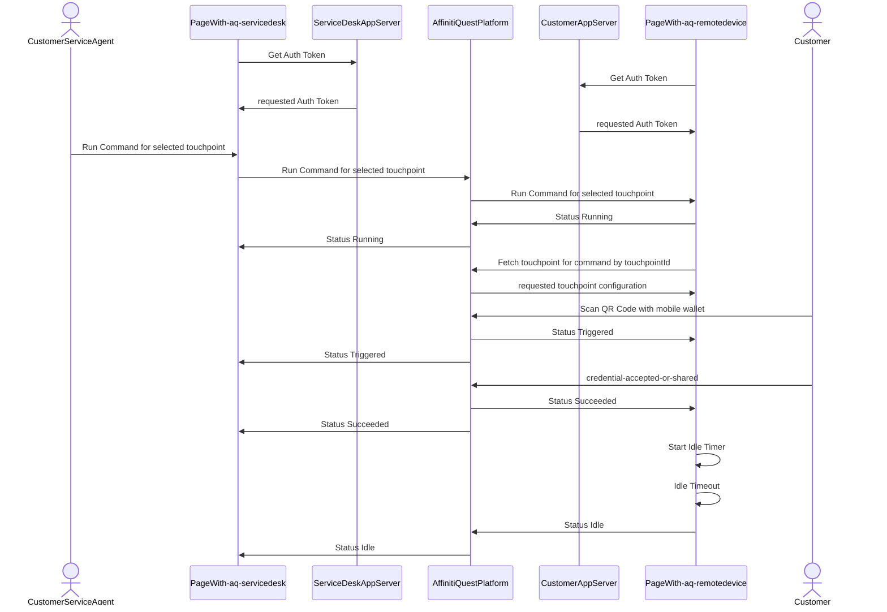
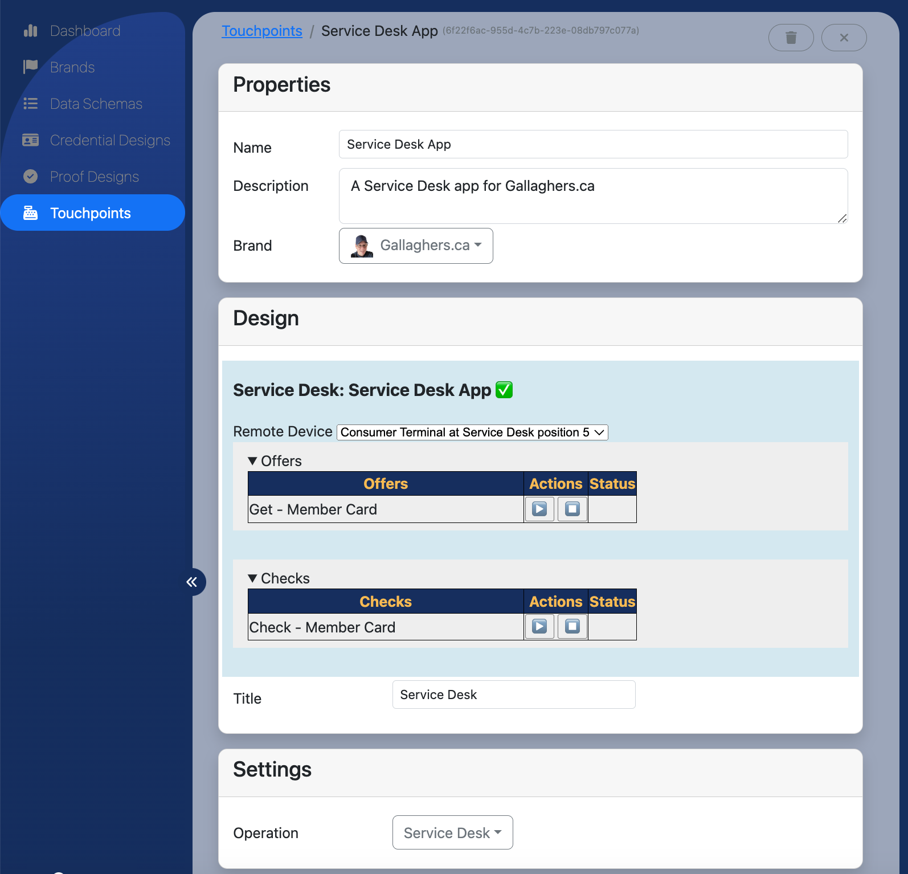

# Remote Control

The AffinitiQuest platform for orchestration of verifiable credentials has a set of custom elements (also known as web components) that can be dropped into any web-based application. These components allow one web browser session to partially controller another web browser session.

These components build atop the touchpoint foundation provided by the platform. The first two of these components are ```<aq-servicedesk/>``` and ```<aq-remotedevice/>```.

For security considerations on use of touchpoints please see: [Touchpoint Security Considerations](security.md)

## High Level

Envision a company that is a customer of the AffinitiQuest platform and that has:

* a web application used by their employees to provide customer service
* a web application running in a device (perhaps a kiosk) that is used by customers of the company
* (Note that these could be the same application)

The customer service agent app could embed the ```<aq-servicedesk/>``` component into one or more pages.

The end-customer facing app could embed the ```<aq-remotedevice/>``` component.

The ```<aq-servicedesk/>``` component allows the customer service agent to push commands to the ```<aq-remotedevice/>```,
thus acting as a remote control. Note that the connections between the components are based on websockets and that the AffinitiQuestPlatform brokers these connections and routes the messages.



## ```<aq-remotedevice/>```

### ```<aq-remotedevice/>``` Registration

When ```<aq-remotedevice/>``` runs on a page, it checks browser local storage to determine it's identity. If no identity is found, then a user interface form is presented allowing the device to be registered with the AffinitiQuest platform as a new kind of touchpoint. Upon successful registration the component saves it's identity to local storage and switches the user interface to display it's idle state. In the idle state, the device is awaiting a command to be issued to it by an ```<aq-servicedesk/>```. A part of registration requires selection of an AffinitiQuest brand that has been previously defined in the AffinitiQuest administration portal. This new device is associated with that brand. After registration, the device will be visible in the administration portal as a new touchpoint of type RemoteDevice.

### ```<aq-remotedevice/>``` Remote Control

When ```<aq-remotedevice/>``` receives a command, it runs the command, presenting the specific command's user interface on the page for the end-customer to interact with. ```<aq-remotedevice/>``` sends status events to the invoking ```<aq-servicedesk/>```. When the command completes, a short timer runs (5-10 seconds). When the timer expires the ```<aq-remotedevice/>``` automatically reverts to it's idle state UI awaiting new commands.

The ```<aq-remotedevice/>``` also can receive a reset command that aborts any command in progress and causes a reversion to the idle state. If a new command is sent to ```<aq-remotedevice/>``` while an existing commmand is running, then the existing command is aborted and the new command is accepted.

## ```<aq-servicedesk/>```

### ```<aq-servicedesk/>``` Configuration

Before using the ```<aq-servicedesk/>``` component on a page, a new ServiceDesk touchpoint must be configured using the AffinitiQuest administration web portal. This configuration process requires selection of a brand that the service desk configuration will be associated with.



### ```<aq-servicedesk/>``` Operation

#### ```<aq-servicedesk/>``` Operation - Remote Device Selection
When ```<aq-servicedesk/>``` runs on a page, it checks browser local storage to determine if the ServiceDesk instance has been associated with a particular remote device. If so, it displayes the currently selected remote device but also allows a different remote device to be selected. Only remote devices that are registered to the same brand that the ```<aq-servicedesk/>``` is configured against will be shown.

#### ```<aq-servicedesk/>``` Operation - Running commands on Remote Devices
After selection of a remote device, a user inteface is presented that shows the available commands that the service desk can dispatch to the remote device. Eligible commands are issue or verify touchpoints defined in the AffinitiQuest administration portal that are associated with the same brand. Selection of an available command will cause the associated ```<aq-remotedevice/>``` to be told to run the command. The display will be updated to show the status of the remote command execution.

Selection of a new command to run while an existing command is executing will cause the existing command to be aborted and the new command to execute.

Any running command can also be stopped.


## Component Details

The following sections provide detail on the ```<aq-remotedevice/>``` and ```<aq-servicedesk/>``` components. The details include:

* component attributes
* events raised by the components that can be subscribed to using javascript
* UI customization

### ```<aq-remotedevice/>``` Component Details

```<aq-remotedevice/>``` is a HTML custom element or web component that can be added to a page so that it can act as a remote device. To use this component and the ```<aq-touchpoint/>``` the following script tags should be added to the header area of the hosting HTML file:
```html
<script type="module" src="https://api.affinitiquest.io/aq-touchpoint/aq-touchpoint.js"></script>
<script type="module" src="https://api.affinitiquest.io/aq-touchpoint/aq-remotedevice.js"></script>
```

In the simplest use of ```<aq-remotedevice/>``` add something similar to the following somewhere in the body of the HTML file:
```HTML
<aq-remotedevice auth_url="/api/auth">
</aq-remotedevice>
```

You can see above the specification of an ```auth_url``` attribute which is a URL provided in your application server. It should return a JWT that allows component to authenticate with the AffinitiQuest platform.

#### ```<aq-remotedevice/>``` Attributes

The following are attributes that can be provided to the component:

|Attribute Name| Description |
|--|--|
| auth_url | required unless auth_jwt is provided |
| auth_method | optional - specifies the HTTP method to use with auth_url, defaults to GET |
| auth_jwt | required unless auth_url is provided |
| app_context | optional - passed as app_context to any dynamically run ```<aq-touchpoint/>``` |
| lang | optional - defaults to "en-ca"  - will be provided to any dynamically run ```<aq-touchpoint/>```|
| logging | log to browser console "true" or "false". default = "false" |
| show_claims | optional - upon successfully running a verify, show the verified claims "true" or "false", default = "false"

#### ```<aq-remotedevice/>``` Events
The following are events that are dispatched by the component. You can receive these events in javascript functions by using the browser's ```addEventListener()```.

|Event Name| Description |
|--|--|
| 'unregistered' | event handler fired when the component has not yet been registered |
| 'registered' | event handler fired when the component has successfully registered |
| 'idle' | event handler fired when the component has registered and is idle - awaiting a run request |
| 'running' | event handler fired when the component has embedded a touchpoint as a result of receiving a run request |
| 'triggered' | event handler fired when a running embedded touchpoint has been scanned by a wallet |
| 'succeeded' | event handler fired when a running embedded touchpoint has finished successfully |
| 'failed' | event handler fired when a running embedded touchpoint has finished in failure |
| 'timeout' | event handler fired when a running embedded touchpoint has finished in timeout |

### ```<aq-servicedesk/>``` Component Details

```<aq-servicedesk/>``` is a HTML custom element or web component that can be added to a page so that it can act as a service desk or portal to control other ```<aq-remotedevice/>``` instances. To use this component and the ```<aq-touchpoint/>``` the following script tags should be added to the header area of the hosting HTML file:
```html
<script type="module" src="https://api.affinitiquest.io/aq-touchpoint/aq-touchpoint.js"></script>
<script type="module" src="https://api.affinitiquest.io/aq-touchpoint/aq-servicedesk.js"></script>
```

In the simplest use of ```<aq-servicedesk/>``` add something similar to the following somewhere in the body of the HTML file:
```HTML
<aq-servicedesk auth_url="/api/auth" tp_id="your-touchpoint-id-goes-here">
</aq-remote-device>
```

You can see above the specification of an ```auth_url``` attribute which is a URL provided in your application server. It should return a JWT that allows component to authenticate with the AffinitiQuest platform.

Also provided is a ```tp_id``` attribute which specifies which service desk configuration to use that has been previously defined in the AffinitiQuest administration portal.

#### ```<aq-servicedesk/>``` Attributes

The following are attributes that can be provided to the component:

|Attribute Name| Description |
|--|--|
| auth_url | required unless auth_jwt is provided |
| auth_method | optional - specifies the HTTP method to use with auth_url, defaults to GET |
| auth_jwt | required unless auth_url is provided |
| lang | optional - defaults to "en-ca"  |
| app_context | optional - passed as app_context to remote device when told to run  |
| logging | log to browser console "true" or "false". default = "false" |
| show_claims | optional - upon successfully running a verify, show the verified claims "true" or "false", default = "false"

#### ```<aq-servicedesk/>``` Events

The following are events that are dispatched by the component. You can receive these events in javascript functions by using the browser's ```addEventListener()```.

|Event Name| Description |
|--|--|
| 'idle' | event handler fired when the a remote device has returned to idle state - awaiting a run request |
| 'running' | event handler fired when the has acknowledged a run request |
| 'triggered' | event handler fired when a remote device running a touchpoint has been scanned by a wallet |
| 'succeeded' | event handler fired when a remote device running a touchpoint has finished successfully |
| 'failed' | event handler fired when a remote device running a touchpoint has finished in failure |
| 'timeout' | event handler fired when a remote device running a touchpoint has finished in timeout |

